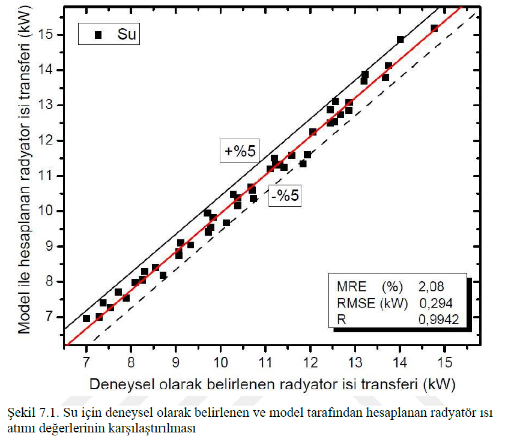
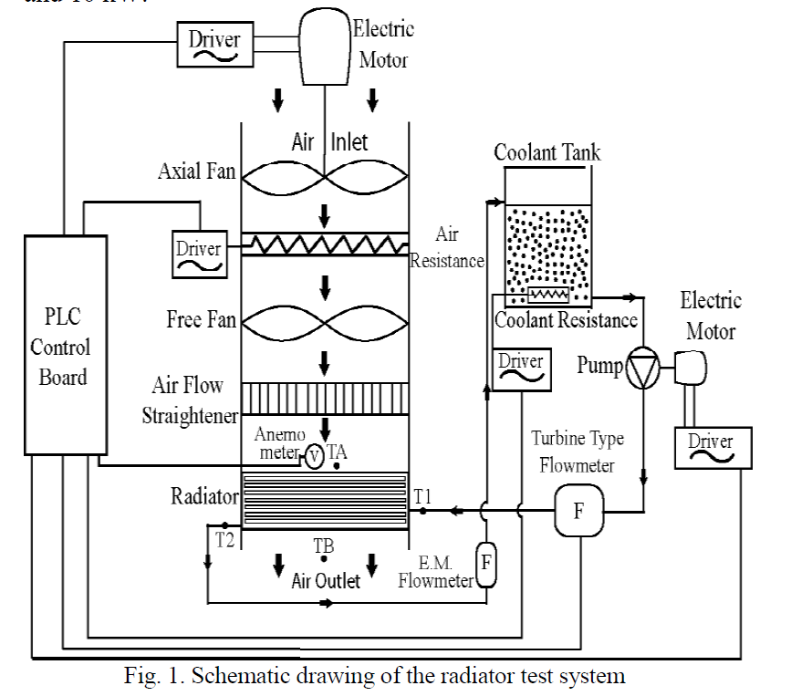
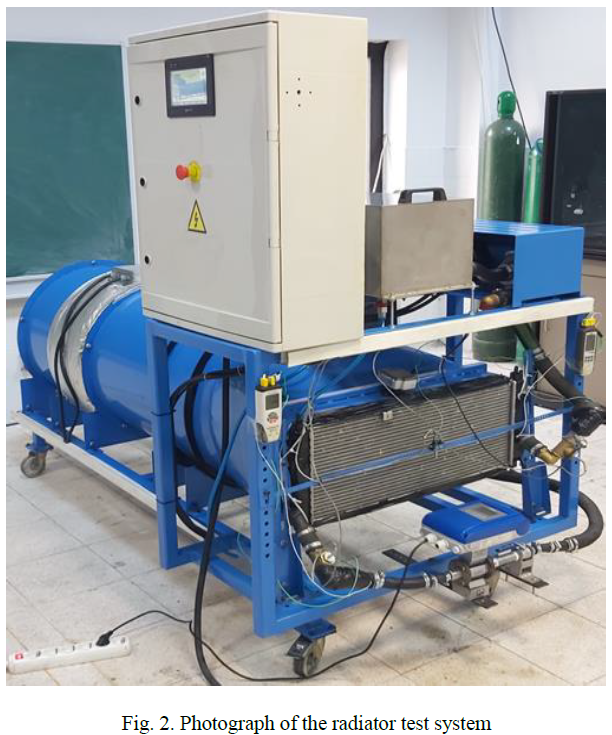
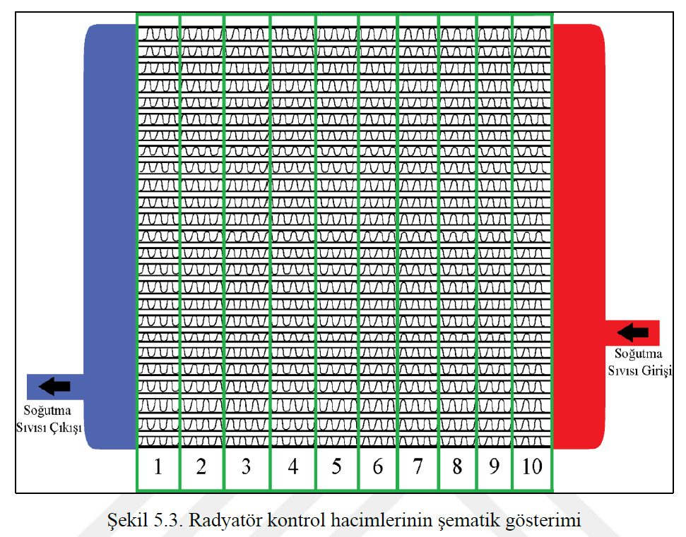

# Automotive Radiator Heat Transfer Analysis

## 📌 Project Overview
This project presents the modeling and experimental validation of heat transfer in flat-tube automotive radiators.

The study focuses on evaluating the thermal performance of different engine coolants under realistic operating conditions and developing a reliable predictive model.

---

## 🎯 Objectives
- Analyze heat transfer behavior in automotive radiators  
- Compare different coolant types (EG/water and PG/water mixtures)  
- Develop a numerical model using the ε-NTU method  
- Validate simulation results with experimental data  

---

## 🧪 Methodology

### Experimental Study
- Custom-built radiator test system  
- Controlled parameters:
  - Air velocity: 1–4 m/s  
  - Air temperature: 25–35°C  
  - Coolant flow rate: 0.10–0.25 l/s  

### Numerical Modeling
- ε-NTU (Effectiveness-NTU) method  
- Radiator divided into control volumes  
- Heat transfer calculated for each section  

---

## 🛠️ Tools & Technologies
- MATLAB / Engineering Equation Solver (EES)  
- Thermodynamics & Heat Transfer Analysis  
- Experimental Data Acquisition  
- Engineering Modeling  

---

## 📊 Key Results
- Water demonstrated the highest heat transfer performance  
- EG and PG mixtures reduced performance by up to ~13%  
- Developed model achieved high accuracy:
  - Error range: ~0% – 2%
 
### Performance Charts
 

---

## 👨‍🔬 My Contributions
- Designed and conducted experimental tests  
- Developed numerical heat transfer model  
- Performed data analysis and validation  
- Compared experimental and simulation results  

---

## 📸 Visuals
### Radiator Test System Schematic

### Experimental Setup Photo

### Control Volume of Raditor

---

## 📎 Project Structure

---

## 📈 Conclusion
This project demonstrates a reliable approach for predicting radiator thermal performance and provides insight into the effectiveness of alternative coolant fluids in automotive applications.

---

## 📎 Project Resources
- **Full Thesis:** [thesis.pdf](thesis.pdf)
- **Author:** Ahmet Gündem
